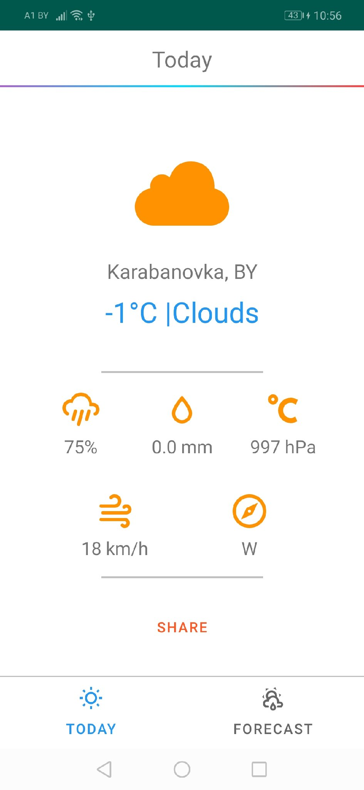

# WeatherApplication
Test task.
Worked with:
- Material design
- RxJava(async operations)
- Retrofit(network calls)
- SwipeRefreshLayout(to support swipe to refresh content)
- Room(offline cashing)
- RecyclerView
- ViewPager
- ConstraintLayout
- PermissionsDispatcher library(for work with permissions)

